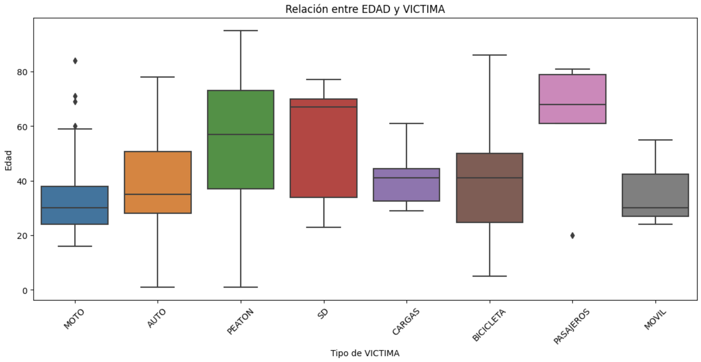
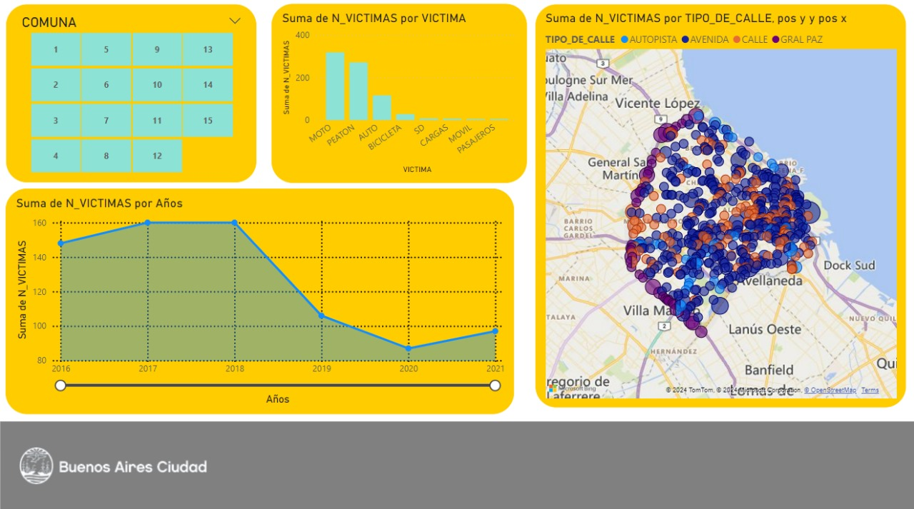

# 🚀 Proyecto Individual 2 🚀

## 📊 Data Analytics 📊

## 🧪 Labs - DS PT 08 🧪
## Autor: Maximiliano Lucchesi 👨🏻‍💻

## Contexto:

Los siniestros viales son eventos en las vías públicas que involucran vehículos y pueden causar desde daños materiales hasta lesiones graves o fatales. En ciudades como Buenos Aires, estos incidentes son una gran preocupación debido al alto volumen de tráfico y la densidad poblacional, afectando la seguridad de los residentes y la infraestructura vial.

Las tasas de mortalidad por siniestros viales son un indicador crítico de la seguridad vial. Reducir estas tasas es esencial para proteger la vida de las personas. La prevención incluye la educación vial, el cumplimiento de normas de tráfico, infraestructuras seguras y vehículos más seguros.

En Argentina, los siniestros viales son la principal causa de muertes violentas, con cerca de 4.000 muertes anuales. Entre 2018 y 2022, hubo 19.630 muertes en siniestros viales. En 2022, se registraron 3.828 muertes. En Argentina, la probabilidad de morir en un siniestro vial es dos o tres veces mayor que en un hecho de inseguridad delictiva.

## Información utilizada:

Se usaron dos archivos en formateo Excel, los cuales fueorn descargados de la página de Bueno Aires Data.

- homicidios.xlsx --> Información sobre homicidios en siniestros viales ocurridos en la Ciudad desde el año 2016 hasta el 2021. Los datos incluyen fecha y ubicación del hecho y tipo de transporte involucrado. Cuenta con dos hojas, una con informacion de los hechos (ubicación, lugar, calle, hora, etc.) y otra con las víctimas (edad, rol en el siniestro, fecha de fallecimiento, etc.)

- diccionario de datos --> Útil a la hora de hacer el EDA y el ETA. Proporciona información que es de gran ayuda.

## EDA y ETL

Se hizo un EDA inicial, para tener un primer contacto con los datos y sus propiedades. Los análisis que se hicieron fueron:

- Análisis de las dimensiones y los tipos de datos

- Valores faltantes

- Outliers

- Distribuciónes de diferentes tipos de variables

También, se utilizaron gráficos y visualizaciones que fueron de gran ayuda para el entendimiento de la situación. Por ejemplo:

Por último, se hicieron algunas transformaciones para poder manejar los datos con mayor facilidad en la etapa siguiente.

## Dashboard

Se realizó un dashboard de Power BI para la visualización interactiva de los resultados, facilitando el análisis intuitivo y la toma de decisiones informadas, el cual se puede consultar en el repositorio. Ejemplo de visualización:

## KPIs

Los KPIs (Indicadores Claves de Desempeño) evaluan el progreso hacia los objetivos de una organización, estos indicadores proporcionn una visión rápida y clara del rendimiento de una empresa en relación con sus metas estratégicas, por lo que son cruciales para el seguimiento del desempeño y la toma de decisiones.

1. Reducir en un 10% la tasa de homicidios en siniestros viales de los últimos seis meses, en CABA, en comparación con la tasa de homicidios en siniestros viales del semestre anterior.

2. Reducir en un 7% la cantidad de accidentes mortales de motociclistas en el último año, en CABA, respecto al año anterior.

## Conclusiones y recomendaciones finales

A continuación, algunas de las conclusiones llegadas luego del análisis completo al archivo 'homicidios.xlsx':

**Conclusiones para los siniestros:**

1. **Avenidas y Siniestros**:
   - La alta incidencia de siniestros en avenidas sugiere la necesidad de implementar medidas de seguridad específicas para estas áreas, como el aumento de la señalización y el control de velocidad.

2. **Comunas Centrales y Tráfico**:
   - Las comunas centrales, como la Comuna 1, tienen una alta concentración de siniestros, posiblemente debido al alto tráfico y densidad de población. Mejorar la infraestructura vial y aumentar la presencia de agentes de tránsito en estas áreas podría reducir los siniestros.

3. **Motociclistas y Peatones**:
   - La alta incidencia de siniestros que involucran motociclistas y peatones subraya la necesidad de campañas de concientización y educación, así como mejoras en la infraestructura para estos usuarios de la vía.

4. **Impacto de la Pandemia en 2020**:
   - La disminución significativa de siniestros en 2020 debido a la pandemia muestra cómo la reducción del tráfico puede impactar positivamente la seguridad vial. Se podrían considerar políticas que promuevan la reducción del uso del automóvil en favor del transporte público y modos de transporte más seguros.

5. **Reactivación y Aumento de Siniestros en 2021**:
   - El aumento de siniestros en 2021 sugiere que la vuelta a la normalidad trae consigo un incremento en los riesgos viales. Es crucial monitorear esta tendencia y ajustar las políticas de seguridad vial para manejar el aumento de tráfico de manera segura.

**Conclusiones para las víctimas:**

1. Edad:
    - Los jóvenes de 20-25 años y las personas mayores de alrededor de 60 años son los grupos más vulnerables.

2. Sexo:
    - Los hombres son significativamente más propensos a ser víctimas en siniestros viales.
    
3. Relación EDAD-VICTIMA
    - Motociclistas: Los jóvenes son los más afectados. Esto sugiere la necesidad de campañas de concientización y educación vial dirigidas a motociclistas jóvenes.
    - Peatones y Pasajeros: Las personas mayores son más vulnerables. Es crucial mejorar la infraestructura peatonal y la seguridad vehicular para proteger a los ancianos.
    - Ciclistas: La amplia variabilidad en las edades indica la necesidad de medidas inclusivas para la seguridad de los ciclistas.
    - General: La variabilidad en las edades de las víctimas en diferentes tipos de vehículos resalta la importancia de adaptar las medidas de seguridad a las características específicas de cada grupo.